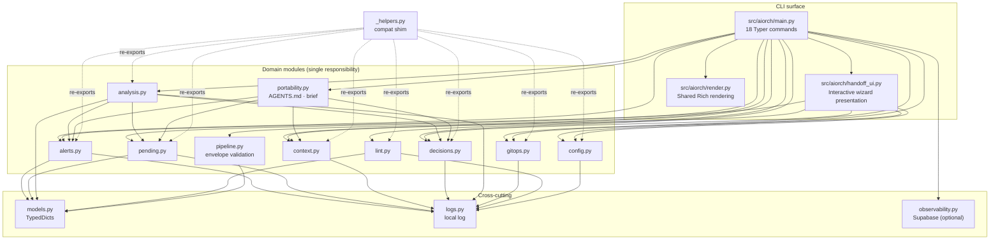
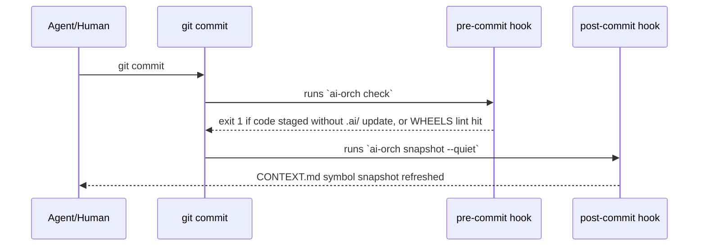
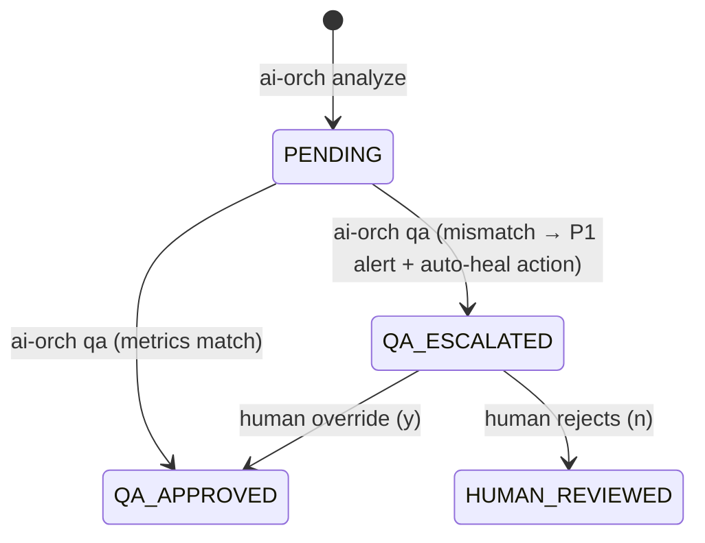

# AI_ARCHITECTURE.md — Master Context Map for AI Agents

> **Read this first.** This file is the mental map of the `ai-orchestrator` codebase,
> written for ANY LLM (Claude, GPT, Gemini, ...) that needs to understand, extend or
> maintain this project. Every path below is exact and relative to the repo root.
> Last structural change: structured inter-agent pipeline contract (2026-09-05).

---

## 1. What this project is

`ai-orch` is a **tech-agnostic CLI** (Python 3.10+, Typer + Rich) that keeps AI agents
in sync across sessions of work on any project. It does this by maintaining a `.ai/`
folder of Markdown context files that every agent reads on arrival and updates on
handoff — plus git hooks that *enforce* that the context never goes stale.

The problem it solves: agents that lose context repeat work, miss alerts, and
contradict earlier decisions. The `.ai/` folder is the shared memory; `ai-orch` is
the toolchain that reads, writes and guards it.

---

## 2. Repository layout (exact paths)

```text
pyproject.toml                  # packaging; entry point: ai-orch = aiorch.main:app
CLAUDE.md                       # repo "system prompt": rules + commands for AI agents
README.md                       # human-facing docs
docs/AI_ARCHITECTURE.md         # THIS FILE — master context map
docs/API.md                     # public helper API reference
docs/TROUBLESHOOTING.md         # known issues and fixes
scripts/supabase_schema.sql     # table for the optional observability backend
scripts/session_start.sh        # SessionStart hook body (arrival brief → agent context)
.env.example                    # SUPABASE_URL / SUPABASE_ANON_KEY template

.claude-plugin/plugin.json      # Claude Code plugin manifest (name: ai-orch)
.claude-plugin/marketplace.json # marketplace catalog — the repo IS its own marketplace
hooks/hooks.json                # SessionStart hook wiring (startup|resume|clear)
skills/
  ai-orch/SKILL.md              # full reference; Claude auto-loads it on context/handoff work
  arrival/SKILL.md              # /ai-orch:arrival — start-of-session protocol
  handoff/SKILL.md              # /ai-orch:handoff — end-of-session protocol
  pipeline/SKILL.md             # multi-agent production standard (envelopes, roles, versions)

src/aiorch/
  main.py                       # CLI surface ONLY — 18 Typer commands, Rich rendering
  handoff_ui.py                 # interactive handoff wizard presentation logic
  render.py                     # shared Rich rendering (triage helpers, observe table)
  portability.py                # AGENTS.md / CLAUDE.md imports / .agents rules + brief
  pipeline.py                   # structured inter-agent envelope + validation
  analysis_ui.py                # analyze/qa presentation (logger injected from main)
  models.py                     # TypedDict contracts for every dict crossing modules
  alerts.py                     # ALERTS.md parse / insert / ID sequencing
  pending.py                    # PENDING.md parse / insert / resolve / ID sequencing
  context.py                    # CONTEXT.md sections, codebase snapshot, export bundle
  decisions.py                  # DECISIONS.md append / count (append-only log)
  analysis.py                   # analyze→qa metrics pipeline (anti-hallucination loop)
  gitops.py                     # ALL git subprocess calls + hook script constants
  lint.py                       # WHEELS.md lint rules (pre-commit enforcement)
  config.py                     # .ai/config.json forgiving loader
  logs.py                       # local logging → .ai/logs/aiorch.log + stderr
  observability.py              # optional Supabase run-metrics logger (never raises)
  _helpers.py                   # BACKWARD-COMPAT SHIM — re-exports all of the above
  templates/                    # files copied into a project's .ai/ by `init`
    ORCHESTRATOR.md  CONTEXT.md  ALERTS.md  DECISIONS.md  DISCUSSIONS.md
    WHEELS.md  PENDING.md  config.json
    ANALYSIS.md                 # runtime-only: NOT copied by init, written by analyze

tests/
  test_cli.py                   # 98 CLI tests (CliRunner, real git, no mocking of fs)
  test_observability.py         # 14 tests for the Supabase logger
  test_modules.py               # 47 domain-module tests (gitops, logs, portability, pipeline, shim)
```

---

## 3. Module dependency map



Dependency rules (enforce these in review):

1. `main.py` may import any domain module; domain modules NEVER import `main.py`.
2. Domain modules may import `models.py` and `logs.py`. Only the two READER modules
   import siblings: `analysis.py` (aggregates alerts/pending/decisions) and
   `portability.py` (aggregates alerts/pending/decisions/context for rendering).
   Neither owns a Markdown format — they read through the owning module's parser.
   `pipeline.py` is not in that category: it imports no sibling at all, because it
   validates a wire format rather than a file on disk.
3. `_helpers.py` contains **no logic** — only re-exports. Never add code there.
4. All `subprocess` calls to git live in `gitops.py` (exceptions: `lint.py` reads the
   git index via `git show`, `analysis.py` runs `pytest`/`git diff` for metrics).

---

## 4. Command → module → file flow

| Command | Implemented in | Domain logic | Reads | Writes |
| --- | --- | --- | --- | --- |
| `init` | `main.py:init` | — | `src/aiorch/templates/*` | `.ai/*` (8 files) |
| `triage` | `main.py:triage` | alerts, pending, config, gitops | `.ai/ALERTS.md`, `.ai/PENDING.md`, `.ai/config.json`, git | stdout only |
| `check` | `main.py:check` | gitops, lint | git index, `.ai/WHEELS.md` | exit code (1 blocks commit) |
| `hook-install` | `main.py:hook_install` | gitops | — | `.git/hooks/pre-commit`, `.git/hooks/post-commit` |
| `handoff` | `handoff_ui.py` | context, alerts, decisions, gitops | prompts | `.ai/CONTEXT.md`, `.ai/ALERTS.md`, `.ai/DECISIONS.md`, git commit |
| `snapshot` | `main.py:snapshot` | context | `src/**/*.py` (AST) | `.ai/CONTEXT.md` (## Codebase Snapshot) |
| `update` | `main.py:update` | context | — | any `.ai/<file>` section |
| `action-add` | `main.py:action_add` | pending | — | `.ai/PENDING.md` |
| `action-resolve` | `main.py:action_resolve` | pending | — | `.ai/PENDING.md` (moves block to ## DONE) |
| `analyze` | `main.py:analyze` | analysis, config | pytest, git, `.ai/*` | `.ai/ANALYSIS.md` (status PENDING) |
| `qa` | `main.py:qa` | analysis, alerts, pending, context | `.ai/ANALYSIS.md` + live state | `.ai/ANALYSIS.md` status; on mismatch also ALERTS + PENDING (auto-heal) |
| `sync` | `main.py:sync` | gitops, context | git status/HEAD | `.ai/CONTEXT.md` (non-interactive) |
| `brief` | `main.py:brief` | portability | all `.ai/*` | stdout or `--out` file |
| `ide-install` | `main.py:ide_install` | portability | — | `AGENTS.md`, `CLAUDE.md`, `.agents/rules/ai-orch.md` |
| `validate` | `main.py:validate` | pipeline | a JSON envelope | exit code (1 = contract violated) |
| `roles` | `main.py:roles` | pipeline, config | `.ai/config.json` | stdout only |
| `export` | `main.py:export` | context | all `.ai/*.md` | stdout or `--out` file |
| `observe` | `main.py:observe` | observability | Supabase `agent_runs` | stdout only |

### The two automation loops





---

## 5. Data contracts

All dict shapes crossing module boundaries are declared in
[src/aiorch/models.py](../src/aiorch/models.py): `Alert`, `AlertDraft`,
`PendingAction`, `ActionDraft`, `DecisionDraft`, `LintRule`, `LintViolation`,
`ProjectMetrics`. **If you pass a new dict between modules, declare it there first.**

Markdown format contracts (positional semantics — section placement carries meaning):

- **ALERTS.md**: severity = the `## P0|P1|P2` section an alert sits under; `## RESOLVED`
  is invisible to parsing but IDs there still count for sequencing (IDs never reused).
- **PENDING.md**: type = the `## Database|Infrastructure|Other` section; `## DONE` same
  rule as RESOLVED. Every action block embeds its own `ai-orch action-resolve <ID>` step.
- **WHEELS.md `## 4. Lint Rules`**: blocks of `### [LINT-XXX]` with three fields —
  **Pattern** (regex in backticks), **Files** (comma-separated globs), **Message** (text).
- **ANALYSIS.md**: `| <label> | <int> |` metric rows are regex-extracted by
  `qa_cross_check` — changing labels requires updating `analysis.py` and tests together.

Output contract of every command: `[OK]` / `[WARN]` / `[ERROR]` line prefixes.
Agents and tests parse these — keep them.

---

## 6. Error handling & logging contracts

- **Local log**: `aiorch.logs.get_local_logger()` writes WARNING+ to stderr and
  DEBUG+ to `.ai/logs/aiorch.log` (created only if `.ai/` exists; gitignored).
  Swallowed non-fatal errors are ALWAYS logged — agents read this file to
  self-diagnose. Logging itself must never crash the CLI.
- **Git queries** raise `aiorch.gitops.GitCommandError`; callers decide
  (e.g. `check` skips with exit 0, `triage` degrades to a fallback scan).
- **Git mutations** (`run_git_commit`) return `(ok, detail)` — always reported verbatim.
- **`observability.SupabaseLogger`** never raises and disables itself without env vars
  `SUPABASE_URL` / `SUPABASE_ANON_KEY` (see [.env.example](../.env.example)).
- **`config.load_config`** returns `{}` for missing/corrupt JSON; callers warn when
  the file exists but parsed empty.

---

## 7. Tests are the contract (159 tests)

- [tests/test_cli.py](../tests/test_cli.py) — CLI behaviour via `typer.testing.CliRunner`
  in `tmp_path` (chdir), with REAL git subprocesses, no filesystem mocking.
- [tests/test_observability.py](../tests/test_observability.py) — Supabase logger
  (mocked client; never hits the network).
- [tests/test_modules.py](../tests/test_modules.py) — domain modules: gitops error
  paths, local logging, and the `_helpers` backward-compat shim.

Run: `pytest` (full), `pytest tests/test_cli.py::test_init_creates_ai_folder` (single).
**Any change must keep the suite green** — agents rely on it to verify their own edits.

Frozen public surfaces (tests import them — breaking these breaks users):

1. `aiorch.main.app` (entry point + every test)
2. `aiorch._helpers.<anything>` including underscore aliases (`_next_action_id`, ...)
3. `aiorch.main.get_logger` (patched by the `observe` CLI tests in `tests/test_cli.py`)

---

## 8. How to extend (checklist for agents)

Adding a CLI command:

1. Declare any new dict shape in `src/aiorch/models.py`.
2. Put the logic in the matching domain module (or create a new one ≤500 lines with a
   WHY-docstring header like the others). Import `get_local_logger` for error paths.
3. Add the `@app.command()` wrapper in `src/aiorch/main.py` — presentation only,
   `[OK]/[WARN]/[ERROR]` prefixes, `typer.Exit(1)` on failure.
4. Re-export new public helpers in `src/aiorch/_helpers.py`.
5. Add tests in `tests/` covering success + at least one failure path.
6. Update the command table in this file, `CLAUDE.md`, and `README.md`.
7. Run `pytest`, then `ai-orch handoff` (or update `.ai/CONTEXT.md`) before committing —
   the pre-commit hook will block you otherwise. That is by design; do not bypass it.

Model routing (who should do the work) is configured per-project in
`.ai/config.json → models.recommendations` and surfaced by `triage`/`handoff`:
architecture & code review → `claude-opus-5` (extended thinking),
feature/bugfix/refactor/tests → `claude-sonnet-5`, docs → `claude-haiku-4-5`.
